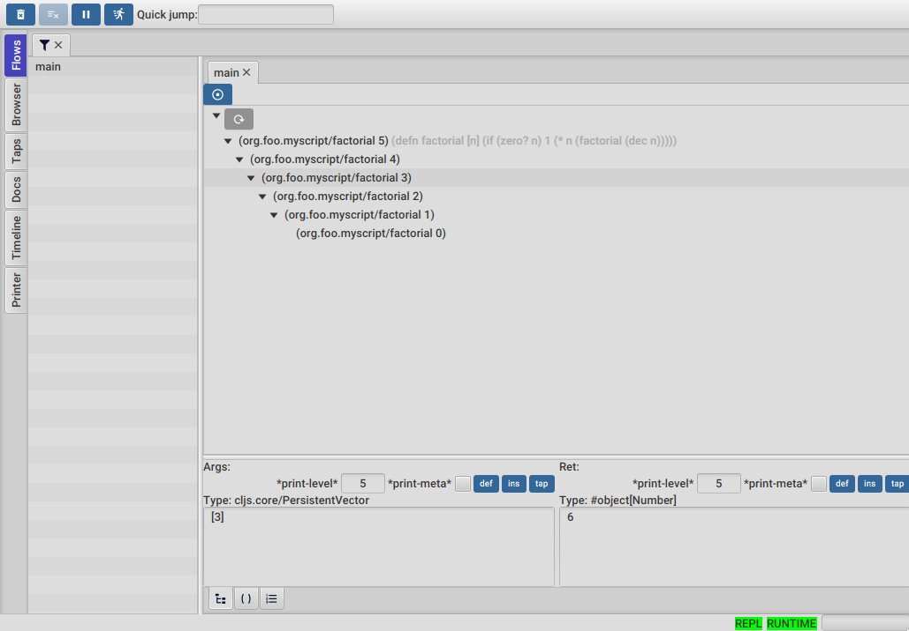
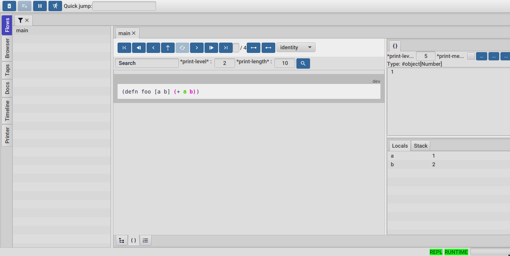

# FlowStorm Full-Stack Debugging Template

A complete template for full-stack Clojure/ClojureScript development with [FlowStorm debugging](https://github.com/jpmonettas/flow-storm-debugger) across both frontend and backend components.

## Features

- **Frontend FlowStorm**: Debug ClojureScript in the browser with shadow-cljs
- **Backend FlowStorm**: Debug Clojure server-side code with embedded debugger
- **Full-Stack Tracing**: UUID-based request correlation across frontend and backend
- **Hot Reloading**: CIDER integration for live backend code updates
- **JSON API**: Ring-based backend with automatic JSON serialization

## Prerequisites

- Java 11+ (for Clojure and FlowStorm)
- Node.js and npm (for shadow-cljs)
- Emacs with CIDER (optional, for hot reloading)

## Quick Start

### 1. Clone and Install Dependencies

```bash
git clone <this-repo>
cd shadow-flow-storm-basic
npm install
```

### 2. Start the Development Environment

```bash
./start-dev.sh
```

This starts 4 processes:
- **Frontend FlowStorm Debugger** (port 7722)
- **Frontend Server** (shadow-cljs on port 8021)
- **nREPL Server** (port 7888, for hot reloading)
- **Backend Server** (Ring on port 3000, with embedded FlowStorm)

### 3. Test the Full-Stack Flow

1. **Open the UI**: http://localhost:8021/index.html
2. **Click "Calculate on Backend"** button
3. **Watch traces** in both FlowStorm debugger windows
4. **Follow UUID correlation** across frontend and backend

## Development Workflow

### Hot Reloading with CIDER

Connect to the running backend for live code updates:

```emacs
M-x cider-connect RET localhost RET 7888 RET
```

Then reload namespaces:
- `C-c C-k` - Reload entire namespace
- `C-c C-c` - Evaluate current form

### Process Management

**Stop all processes:**
```bash
./kill-dev.sh
```

**Restart everything:**
```bash
./kill-dev.sh && ./start-dev.sh
```

**Clean all generated files:**
```bash
./clean.sh
```

This removes all compilation artifacts, caches, and node modules. After cleaning, run `npm install` then `./start-dev.sh` to restore everything.

## Architecture

### Frontend (ClojureScript)
- **Port**: 8021 (HTTP server)
- **FlowStorm**: Remote debugging on port 7722
- **Framework**: Reagent + shadow-cljs
- **HTTP Client**: cljs-ajax

### Backend (Clojure)
- **Port**: 3000 (HTTP server)
- **FlowStorm**: Embedded local debugging
- **Framework**: Ring + Reitit
- **Features**: JSON serialization, CORS support

### Request Correlation
- UUID generated on frontend for each request
- Passed via `X-Request-ID` header to backend
- Visible in both FlowStorm debuggers for end-to-end tracing

## Expected Trace Flow

When you click "Calculate on Backend":

1. **Frontend FlowStorm**:
   - Button click handler
   - UUID generation
   - HTTP request preparation

2. **Backend FlowStorm**:
   - Request reception with UUID
   - Input validation
   - Multi-step calculation (sum → multiply → factorial)
   - JSON response formatting

3. **UUID Correlation**: Same UUID visible in both debugger logs

## Configuration

### FlowStorm Instrumentation Scope

**Frontend** (in `shadow-cljs.edn`):
```clojure
:dev-test {:devtools {:preloads [flow-storm.api]}
           :compiler-options
           {:external-config
            {:flow-storm {:inst-ns-regex "org.foo.*"}}}}
```

**Backend** (in `deps.edn`):
```clojure
:backend-storm {:jvm-opts ["-Dflowstorm.inst.ns.regex=org.foo.*"]}
```

### Dependencies

Key dependencies in `deps.edn`:
- `com.github.flow-storm/flow-storm-inst` - FlowStorm instrumentation
- `ring/ring-json` - JSON middleware for Ring
- `ring-cors/ring-cors` - CORS support
- `nrepl/nrepl` - Hot reloading support

## Troubleshooting

### Port Conflicts
If ports are busy, use `./kill-dev.sh` to clean up stubborn processes.

### Build Issues
If you encounter compilation or cache issues, use `./clean.sh` to remove all generated files:
- shadow-cljs compilation artifacts (`public/js/`)
- Clojure cache (`.cpcache/`)
- Node modules (`node_modules/`)
- Shadow-cljs cache (`.shadow-cljs/`)

After cleaning, restore dependencies with `npm install` then `./start-dev.sh`.

### FlowStorm Connection Issues
- Frontend FlowStorm uses WebSocket connection (`ws://localhost:7722/ws`)
- Backend FlowStorm uses embedded debugger (no separate connection needed)
- Check that both debugger windows show "Connected" status

### JSON Serialization
Backend automatically converts Clojure maps to JSON via `wrap-json-response` middleware.

### Hot Reloading
If CIDER connection fails, ensure nREPL server is running on port 7888:
```bash
lsof -i :7888
```

## Key Files

- `start-dev.sh` - Startup script for all processes
- `kill-dev.sh` - Cleanup script for running processes
- `clean.sh` - Removes all generated files and compilation artifacts
- `src/org/foo/frontend/core.cljs` - Frontend entry point
- `src/org/foo/backend/core.clj` - Backend server with FlowStorm integration
- `src/org/foo/backend/handlers.clj` - API request handlers
- `shadow-cljs.edn` - ClojureScript build configuration
- `deps.edn` - Clojure dependencies and aliases

## Documentation

- [FlowStorm User Guide](https://jpmonettas.github.io/flow-storm-debugger/user_guide.html)
- [shadow-cljs Documentation](https://shadow-cljs.github.io/docs/UsersGuide.html)
- [Ring Documentation](https://github.com/ring-clojure/ring)

## Screenshots



